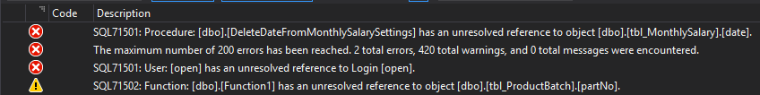
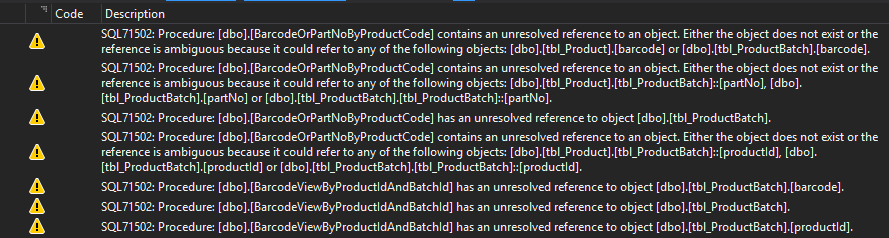
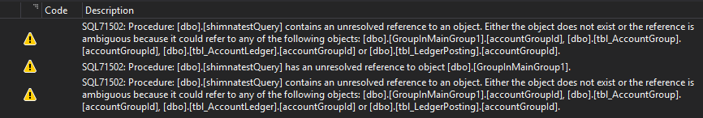
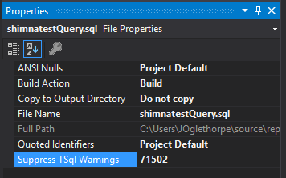
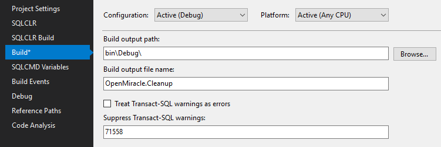

# Setting up the Database

## Creating the database project

### Create a local instance of the database

This project includes the actual [database data and log files](https://github.com/JamieO53/OpenMiracle/tree/master/Database), so I have to attach a local copy to SQL Server. For convenience I keep the same name, that is DBOpenMiracle.

### Create the cleanup solution and project

In Visual Studio, I create a new solution and SQL Server Project both called `OpenMiracle.Cleanup`.

I use the project's Schema Compare action to script the objects in the database.

## Cleaning up the database

As with any legacy database, this one is full of junk. A fabulous feature of SSDT projects is the validation. You don't need to create the database to find errors, and SSDT is much more thorough.

I work systematically through the errors and warnings. There are two kinds of warnings:

* Missing objects

    Almost all of these are the result of debris left by developers as they work, and don't clean up after following false paths.

* Case differences in identifiers

    These are not worth the trouble to fix

I have a look at the Error List

The easiest issue to deal with is the missing `open` login. I create that in the new Security folder. I rename the file open_1.sql to open_login.sql

The next issue requires a look at `DeleteDateFromMonthlySalarySettings':

```SQL
CREATE PROCEDURE [dbo].[DeleteDateFromMonthlySalarySettings]
-- Author: <Cybrosys Technologies>
-- Create date:<20-April-2013>
-- Description: <Stored procedure  To DeleteDateFromMonthlySalarySettings>

AS
    ALTER TABLE tbl_MonthlySalary
    DROP COLUMN date
```

This is also easy. Obviously the date column is no longer in tbl_MonthlySalary. I remove the procedure.

I look at the first warning referring to Function1. This is an obvious error, so I remove the function.

The next batch of warnings are all for SQL71502, that is an unresolved reference to an object.


 Most of these refer to missing tables, in this case `tbl_ProductBatch`

 ```SQL
CREATE PROCEDURE [dbo].[BarcodeOrPartNoByProductCode]
-- Author: <Cybrosys Technologies>
-- Create date:<17-Aug-2013>
-- Description: <Stored procedure for Barcode Or PartNo By Product Code>
    @productCode varchar(max)
AS
    select barcode,tbl_ProductBatch.partNo
    from tbl_ProductBatch
    inner join tbl_Product on tbl_Product.productId=tbl_ProductBatch.productId
    where tbl_Product.productCode=@productCode
 ```

 Some investigation shows that the `barcode` column is in the tbl_Batch table. This looks like the developer changed his mind and did not clean up. This happens a lot. This procedure obviously cannot execute, so I remove it.

 There may be a reference to the procedure in the C# application, in which case it should be fixed instead. That is not necessary for my purpose, so I just remove all the procedures like this.

 There are some that should not be removed. For example:

```SQL
CREATE PROCEDURE [dbo].[CompanyConnectionClose]
    -- Author: <Cybrosys Technologies>
    -- Create date:<28-03-2013>
    -- Description: <Stored procedure to CompanyConnectionClose >
AS
    EXEC sp_detach_db 'DBOpenMiracle', 'true'
```

This calls the `sp_detach_db` system procedure. I fix this by adding a reference to the `master` database.

```SQL
CREATE PROCEDURE  [dbo].[CustomerCheckreferenceAndDelete]
-- Author: <Cybrosys Technologies>
-- Create date:<24-5-2013>
-- Description: <Stored procedure to CustomerCheckreferenceAndDelete >
 @ledgerId NUMERIC(18,0)
   AS
  IF NOT EXISTS (SELECT ledgerId FROM tbl_AdvancePayment WHERE ledgerId=@ledgerId)
   IF NOT EXISTS (SELECT ledgerId FROM tbl_DailySalaryMaster WHERE ledgerId=@ledgerId)
  IF NOT EXISTS (SELECT ledgerId FROM tbl_SalaryVoucherMaster WHERE ledgerId=@ledgerId)
 IF NOT EXISTS (SELECT ledgerId FROM tbl_ServiceMaster WHERE ledgerId=@ledgerId)
...
  IF NOT EXISTS (SELECT ledgerId FROM tbl_PDCClearanceMaster WHERE ledgerId=@ledgerId)
  BEGIN
  DELETE FROM tbl_AccountLedger WHERE ledgerId=@ledgerId
  END
```

The `tbl_SalaryVoucherMaster` table does not exist, so I delete that line

There is a false positive which needs to be allowed for:


This procedure contains this complicated query

```SQL
WITH GroupInMainGroupP1 (accountGroupId,HierarchyLevel) AS
    (
    SELECT accountGroupId,1 AS HierarchyLevel
        FROM tbl_AccountGroup
        where  accountGroupId=6 --OR groupUnder=6
        UNION ALL

        SELECT e.accountGroupId,s.HierarchyLevel+1 AS HierarchyLevel
        FROM tbl_AccountGroup AS e,GroupInMainGroupP1 AS s
        WHERE e.groupUnder=s.accountGroupId
    )

    SELECT  accountGroupId, ledgerId, name,
...
FROM
                       tbl_AccountGroup AS G INNER JOIN
                      tbl_AccountLedger AS AL ON G.accountGroupId = AL.accountGroupId INNER JOIN
                      tbl_LedgerPosting AS LP ON AL.ledgerId = LP.ledgerId
WHERE --LP.date BETWEEN  @fromDate AND @toDate and
 G.accountGroupId IN (SELECT accountGroupId FROM GroupInMainGroup1 where accountGroupId<>@accountGroupId)
GROUP BY G.accountGroupId,G.accountGroupName ,G.nature)
)R
```

The warnings refer to the unqualified identifiers in the subquery

```SQL
(SELECT accountGroupId FROM GroupInMainGroup1 where accountGroupId<>@accountGroupId)
```

T-SQL is perfectly happy with this, so I suppress the warning on the procedure:



Once all the warnings were dealt with, I did a *Rebuild All* of th project, and got a list of `SQL71558` warnings of differences in case. I suppressed these in the project's Properties Build page:

